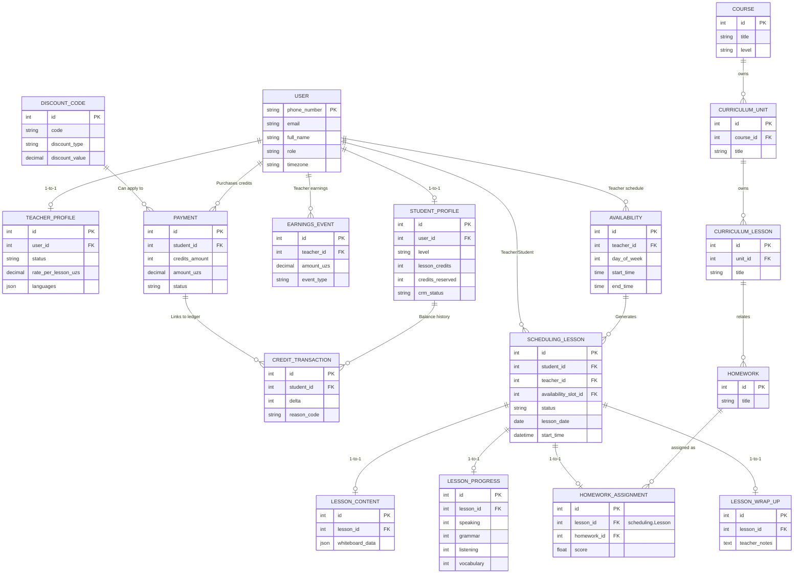

# Online School Database Documentation

This document provides a comprehensive overview of the database schema for the Online School backend, mapping out all models, their fields, their relationships, and application-specific settings.

## 1. Apps & Database Models

The project uses Django's ORM. The databases are structured across the following logical applications:

### `accounts`
Manages users, authentication, profiles, and credit ledgers.
- **`User` (AbstractUser):** Core user model.
  - `phone_number` (CharField, Unique, USERNAME_FIELD)
  - `email` (EmailField)
  - `full_name` (CharField)
  - `role` (Choices: STUDENT, TEACHER, ADMIN, NEW)
  - `profile_picture` (ImageField)
  - `timezone` (CharField, IANA Timezone)
- **`UserIdentity`:** Social auth links (Google, Telegram).
  - `user` (FK to User), `provider` (CharField), `provider_id`, `email`, `username`.
- **`PhoneOTP`:** Stores OTPs for verification.
  - `phone_number`, `otp`, `count`.
- **`TeacherProfile`:** 1-to-1 with User.
  - `bio`, `headline`, `status`, `languages` (JSON), `language_certificates` (JSON), `subjects`, `youtube_intro_url`, `rating`, `lessons_taught`, `rate_per_lesson_uzs`, `payout_day`.
- **`StudentProfile`:** 1-to-1 with User.
  - `level`, `lesson_credits`, `credits_reserved`, `goals`, `crm_status`, `tags`, `churn_reason`.
- **`AdminNote`:** Admin notes for a student.
  - `student` (FK to StudentProfile), `body`, `created_by` (FK to User).
- **`CreditTransaction`:** Ledger for student credit balances.
  - `student` (FK to StudentProfile), `delta` (Integer), `reason_code`, `reason_detail`, `payment` (FK to Payment), `lesson` (FK to scheduling.Lesson), `created_by`.
- **`EarningsEvent`:** Ledger for teacher earnings.
  - `teacher` (FK to User), `event_type`, `amount_uzs`, `reason`, `lesson` (FK to scheduling.Lesson).
- **`ActivityEvent`:** Audit log for system events.
  - `event_type`, `actor` (FK to User), `subject_student`, `subject_teacher`, soft refs (`payment_id`, `lesson_id_ref`, `credit_tx_id`, `earnings_event_id`), `summary`, `metadata` (JSON).

### `auth_telegram`
Handles Telegram-specific authentication flows.
- **`TelegramAccount`:** 1-to-1 with User.
  - `telegram_id` (BigIntegerField), `username`, `first_name`, `last_name`, `photo_url`.
- **`TelegramLoginToken`:** Temporary tokens for webhook auth.
  - `token` (UUID), `expires_at`, `used_at`, `verified_at`, `telegram_id`, `raw_update` (JSON).

### `banners`
Simple banner campaign management.
- **`BannerCampaign`:**
  - `name`, `placement`, `target_role`, `target_platform`, `image_web`, `image_mobile`, `target_type`, `target_value`, `start_at`, `end_at`, `is_active`.

### `curriculum`
Defines the course structure (Courses, Units, Lessons) and interactive content.
- **`Course`:** `title`, `description`, `level`.
- **`Unit`:** `course` (FK to Course), `title`, `order`.
- **`Lesson`:** `unit` (FK to Unit), `title`, `order`, `description`, `slides_pdf`.
- **`PdfAsset`, `AudioAsset`, `VideoAsset`:** Teacher-uploaded assets. `owner` (FK to User), `title`, `file`.
- **`LessonActivity`:** `lesson` (FK to Lesson), `title`, `activity_type`, `content` (JSON), `order`.

### `homework`
Manages homework templates and student assignments.
- **`Homework`:** Template for assignments. `title`, `description`, `level`.
- **`HomeworkActivity`:** `homework` (FK to Homework), `activity_type`, `order`, `content` (JSON), `points`.
- **`HomeworkAssignment`:** Student's active assignment. `lesson` (OneToOne to scheduling.Lesson), `homework` (FK to Homework), `due_date`, `is_completed`, `score`, `percentage`.
- **`StudentActivityResponse`:** Student's answers. `assignment` (FK to HomeworkAssignment), `activity` (FK to HomeworkActivity), `answer_data` (JSON), `is_correct`.

### `lessons`
Data tied to active virtual classrooms.
- **`LessonContent`:** `lesson` (OneToOne to scheduling.Lesson), `teacher_notes`, `whiteboard_data` (JSON).

### `marketing`
Marketing campaigns, CRM, and discount codes.
- **`Banner`:** Advanced banners (`title`, `image`, `target_audience`, `clicks`, `impressions`).
- **`Announcement`:** Dismissible alerts.
- **`EmailCampaign`, `SmsCampaign`:** Campaign targets, templates, and analytics.
- **`PushCampaign`, `PushToken`:** Push notifications.
- **`DiscountCode`:** `code`, `discount_type`, `discount_value`, `min_purchase_amount`, `max_uses`.
- **`DiscountCodeUsage`:** `code` (FK to DiscountCode), `user` (FK to User), `payment` (FK to Payment).
- **`MarketingMetricsSnapshot`:** Analytics aggregations.

### `payments`
Handles student purchases.
- **`Payment`:** `student` (FK to User), `credits_amount`, `amount_uzs`, `currency`, `method`, `provider`, `status`, `receipt_id`, card metadata.

### `progress`
Tracking feedback post-lesson.
- **`LessonProgress`:** `lesson` (OneToOne to scheduling.Lesson), `speaking`, `grammar`, `vocabulary`, `listening` (Scores 1-5), `teacher_feedback`.

### `scheduling`
Core logic for teacher availability and live lesson bookings.
- **`Availability`:** Recurring schedule. `teacher` (FK to User), `day_of_week`, `start_time`, `end_time`.
- **`Lesson`:** Booked session. `availability_slot` (FK to Availability), `lesson_date`, `teacher` (FK to User), `student` (FK to User), `status` (PENDING, CONFIRMED, COMPLETED, CANCELLED), `room_sid`, `meeting_link`. Maintains presence with `active_students_count` and `active_teacher`.
- **`LessonWrapUp`:** `lesson` (OneToOne to Lesson), `teacher_notes`, `homework_text`, `homework_due_date`.
- **`LessonRating`:** `lesson` (OneToOne to Lesson), `student` (FK to User), `teacher` (FK to User), `rating`, `comment`.
- **`LessonTemplate` & `Activity`:** (Different from curriculum modules, potentially used by scheduling).

---

## 2. Global Variables & References

Key conceptual database values and choices frequently used in the logic:
- **`Role Choices`**: `STUDENT`, `TEACHER`, `ADMIN`, `NEW`
- **`Timezone`**: Defaults to `Asia/Tashkent`.
- **`Student CRM Statuses`**: `lead`, `trial`, `paying`, `inactive`, `churned`
- **`Teacher Staff Statuses`**: `pending`, `active`, `inactive`
- **`Lesson Statuses`**: `PENDING`, `CONFIRMED`, `COMPLETED`, `CANCELLED`, `STUDENT_ABSENT`, `TECHNICAL_ISSUES`
- **`Payment Statuses`**: `pending`, `succeeded`, `failed`, `refunded`, `canceled`
- **`Credit Transaction Reasons`**: `purchase`, `lesson`, `student_absent`, `admin_add`, `admin_sub`, `refund`
- **`Earnings Event Types`**: `lesson_credit`, `adjustment`, `payout`, `correction`

---

## 3. Entity-Relationship Diagram (ERD)

